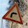
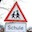
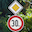
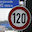

# **Traffic Sign Recognition** 

[//]: # (Image References)

[image1]: ./images/class_distribution.png "Distribution of Classes"
[image2]: ./images/example_images.png "Image Samples"
[image3]: ./images/example_images_gray.png "Pre-processed Image Samples"
[image4]: ./images/base_model_acc.png "Accuracy vs Epoch, Base Model"
[image5]: ./images/best_model_acc.png "Accuracy vs Epoch, Best Model"
[image6]: ./new_sign_images/dangerous_curve.jpg "Traffic Sign 1"
[image7]: ./new_sign_images/children_crossing.jpg "Traffic Sign 2"
[image8]: ./new_sign_images/priority_and_speed.png "Traffic Sign 3"
[image9]: ./new_sign_images/straight_or_left.png "Straight or Right"
[image10]: ./new_sign_images/120.jpeg "Traffic Sign 5"
[image11]: ./images/result_probabilities_1.png "Probabilities, image 1"
[image12]: ./images/result_probabilities_2.png "Probabilities, image 2"
[image13]: ./images/result_probabilities_3.png "Probabilities, image 3"
[image14]: ./images/result_probabilities_4.png "Probabilities, image 4"
[image15]: ./images/result_probabilities_5.png "Probabilities, image 5"

### Notebook

A Jupyter notebook containing the code of this project can be found [here](https://github.com/lragnarsson/CarND-Traffic-Sign-Classifier-Project/blob/master/Traffic_Sign_Classifier.ipynb)

### Data Set Summary & Exploration

#### 1. Data Set Summary
I used standard python functions and numpy to calculate the size and shape of the data sets:

* The size of training set is 34799
* The size of the validation set is 4410
* The size of test set is 12630
* The shape of a traffic sign image is (32, 32, 3)
* The number of unique classes/labels in the data set is 43

#### 2. Data Set Exploration
In order to investigate the distribution of different classes in the training, validation and testing data sets, I plotted a normalized histogram shown in the figure below.

![Distribution of Classes][image1]

The three different data sets are visualized on top of eachother in different colors with transparency and compared with a uniform distribution. The histogram shows that the data sets are quite skewed, many classes are more than 10 times more prevalent than others. This can lead to the more prevalent classes becoming prioritized when only using cross-entropy as the cost function. A model could for example incorrectly classify the first class "Speed limit (20 km/h)" every time and still reach over 99 % accuracy. This is also a limitation of using accuracy as a score for the model.

To get a sense of how the images in dataset look, some random data samples were visualized, see the figure below. From these images we can see that the photos have quite large variations in lighting, camera angles and backgrounds. Most of these samples look quite centered in the image and with only slight rotations. This could imply that using data augmentation in the form of random translations and rotations could help the model generalize better to different real world situations. Mirroring the images would not be a good approach for augmentation since many classes are mirror images of eachother.

![Example Images][image2]

### Design and Test a Model Architecture

#### 1. Pre-processing

The only pre-processing done for the final model was to convert the images to grayscale using OpenCV, and then normalize them to zero mean and equal variance using numpy to better condition the training problem. See section 4 for more details.

The figure below shows a random sample of pre-processed images.

![Pre-processed Image Samples][image3]

#### 2. Model Architecture
The architecture used was simply adapting the Lenet architecture by changing the dimensions of the input and output layers to fit a grayscale image and produce logits for 43 differenct classes.

Specifically, it has the following layers:

| Layer         		|     Description	        					| 
|:---------------------:|:---------------------------------------------:| 
| Input         		| 32x32x1 Grayscale image   					| 
| Convolution 5x5     	| 1x1 stride, valid padding, outputs 28x28x6 	|
| RELU					|												|
| Max pooling	      	| 2x2 stride,  outputs 14x14x6 			    	|
| Convolution 5x5	    | 1x1 stride, valid padding, outputs 10x10x16 	|
| RELU					|												|
| Max pooling	      	| 2x2 stride,  outputs 5x5x6 			    	|
| Flatten   	      	| outputs 400x1              			    	|
| Fully connected		| outputs 120x1									|
| RELU					|												|
| Fully connected		| outputs 84x1									|
| RELU					|												|
| Fully connected		| outputs logits 34x1							|

#### 3. Training Approach

To train the model, I used the AdamOptimizer with a learning rate of 0.0001 to minimize the cross entropy which was weighted to combat the effects of a skewed data set. Being incorrect on the less prevalent classes was punished higher in order to avoid having the network favoring high accuracy for only the most prevalent classes. The final model was trained with a batch size of 128 for 50 epochs.

Using dropout on the convolutional layers reduced the overall accuracy of the trained model which is why KEEP_RATE_CONV was set to 1.0. BETA was the coefficient used for the L2 norm to calculate the cost of having too large weights in the model.

| Hyper Parameter  		|     Value	        | 
|:---------------------:|:-----------------:| 
| EPOCHS         		| 50   	            |
| BATCH_SIZE         	| 128               |
| LEARNING_RATE			| 0.001         	|
| KEEP_RATE_CONV      	| 1.0   	    	|
| KEEP_RATE_FC   	    | 0.55            	|
| BETA					| 0.0001	    	|

In the figure below, the training and validation accuracy over 30 epochs can be seen when not using dropout, regularization or cost weighting. The large gap between training and validation accuracy and the fact that the training accuracy is very high are both signs of overfitting.

![Pre-processed Image Samples][image4]

In the figure below all above mentioned methods are enabled and we can see that the validation accuracy reaches much higher.
![Pre-processed Image Samples][image5]

#### 4. Method of Reaching the End Results
I started by only normalizing the images and then simply adapting the network architecture by changing the dimensions of the input and output layers to fit and RGB image and produce logits for 43 differenct classes. This baseline model could with certain hyperparameters reach above the required 93 % validation accuracy, but not very reliably.

There was a large difference between training and validation accuracy which could be a sign of overfitting. I adding L2 regularization as a way to combat this which made a small improvement but not very significant at this stage.

The second attempt at improvement was to convert the images to grayscale. Although there is some useful information to be inferred from the colors on the signs, there is also the risk of the background color being incorrectly interpreted to be a useful indication. For example the "Double curve" sign might be more common on the countryside where there is more often trees in the background, leading to our model interpreting the green background as a significant feature of that sign.

Instead of converting them to grayscale in the pre-processing step, I first tried adding a new layer to the model which reduced the depth of the image from 3 to 1. The idea was to let the network learn this step by itself. I tried both with a convolutional and a fully connected layer. Neither approach proved to be very good.

After this I went back to the standard Lennet architecture and converted the images to grayscale during the pre-processing step instead. This lead to a slight improvement in accuracy, consistently getting above 93 % validation accuracy.

In order to investigate further improvements, I decided to tackle the problem of a skewed data set by weighting the cost of failing at different classes based on their relative prevalance in the training and testing datasets. At first glance, one might think that this would have a negative effect on the accuracy because we areno longer just optimizing to maximize it. And indeed this method seems to lower the training accuracy. However it lead to quite a large improvement in validation accuracy since the skew of that dataset might be different than that of the training data set.

The last method tried was to add dropout to the convolutional layers and first two fully connected layers in the model. When using a keep rate of 60 % for both the convolutional and the fully connected layers together with the other methods described above the model was able to achieve a validation accuracy upwards of 97 %.

#### 5. Results

My final model results were:
* Training set accuracy of **0.997**
* Validation set accuracy of **0.968**
* Test set accuracy of **0.939**

### Testing the Model on New Images

#### 1. New Images Data Set

I have collected 5 images of german traffic signs on the internet, cropped and resized them to 32x32 pixels. Shown in original size below.

![alt text][image6] ![alt text][image7] ![alt text][image8] ![alt text][image9] ![alt text][image10]

The labels, in order, are: dangerous curve to the right, children crossing, priority road and speed limit (30 km/h), go straight or left, speed limit (130 km/h).

They were chosen to have varying backgrounds and rotations. The third image with two signs on the same pole was chosen as an interesting case when looking at the logits. The first and fourth image are interesting because there are mirrored versions of them available. Furthermore the speed limit sign will be interesting to see how well it can distinguish the numerical value between different speed limits. The same images scaled up to 200x200 pixels are shown below.

     

#### 2. Model Prediction Results

Here are the results of the prediction:

| Image			                 |     Prediction	        					| 
|:------------------------------:|:--------------------------------------------:| 
| Dangerous curve to the right   | Vehicles over 3.5 metric tons prohibited		| 
| Children crossing          	 | Speed limit (50 km/h)						|
| Priority road				     | Dangerous curve to the right					|
| Go straight or left	      	 | Go straight or left			 				|
| Speed limit (130 km/h)		 | Speed limit (130 km/h)   					|

The model was able to correctly predict 2 out of 5 traffic signs, which gives an accuracy of 40%. This is lower than what was achieved on the test data set. However it is a very small data set so this number should be taken with a grain of salt. The first three images which were all incorrectly predicted have some aspects which could make them difficult. The first one has a fairly high rotation, the second has a text sign in the same image and the third one has both a speed limit and a priority road sign in the same image. The fourth image is a vector graphics image which should be the ideal situation. The fifth image is fairly large and clear.

#### 3. Predicted Probabilities

In order to better understand the predicted results of the model, the top 10 softmax probabilites are plotted in the images below.

  **Dangerous curve to the right probabilities**

As is shown by the figure below, the model was not close to being correct for this image. It was over 96 % sure on its incorrect prediction. The correct prediction appears in fourth place with only 0.56 % probability. Perhaps augmenting the data set with rotated images could have impoved the models ability to generalize to this image.
![alt text][image11]

 **Children crossing probabilities**

For this image, two of the top three results were speed limit signs. Perhaps the black text on a white background "Schule" under the sign was picked up here to fool the model. The correct label was 10th place with a probability of 0.004 %.
![alt text][image12]

 **Priority road probabilities**

This image was chosen to be difficult. Interestingly enough, neither priority road or speed limit (30 km/h) appears in  the top 10 most probable labels according to the model.
![alt text][image13]

  **Go straight or left probabilities**

This sign was chosen to be the most straight forward to classify without disturbing backgrounds or weird angles. The correct class was chosen and given a 100 % probability. One interesting thing to note is that the label "Go straight or right" did not appear in the top 10 results.

![alt text][image14]

 **Speed limit (130 km/h) probabilities**

The last image was also classified correctly with a high certainty of 99.5 %. The second most likely label was speed limit (100 km/h) which is probably the closest sign for a human predicting as well.

![alt text][image15]

